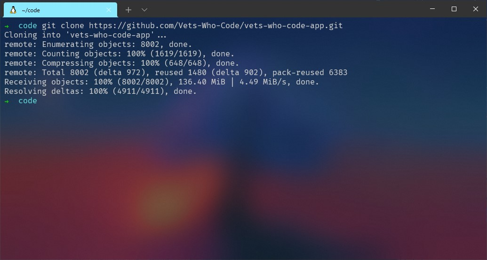
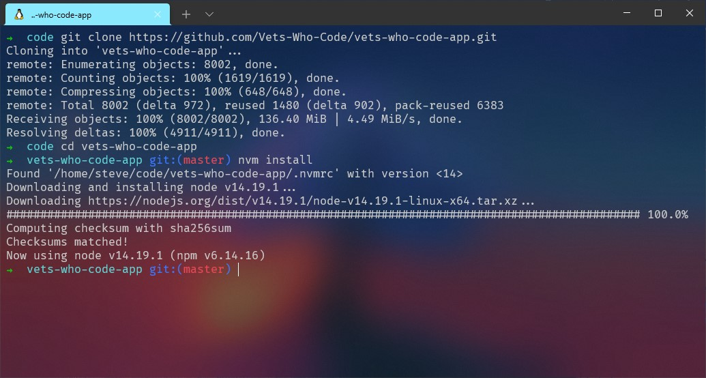

<p align=center>
  
  
  <a href=https://github.com/Vets-Who-Code/vwc-site/blob/master/LICENSE>
    
  </a>
  <a href=https://github.com/Vets-Who-Code/vwc-site/blob/master/.github/contributing.md>
    
  </a>
  
</p>

<p align=center>
  
</p>

# Vets Who Code Web App

The Vets Who Code Web App is a Jamstack Applicaton designed for speed and to ease the learning curve of our veterans contributing to open source.
By doing this we can teach our veterans with practical use cases, all the while making a professional product that is fast and serverless.

## Getting Started

These instructions will get you a copy of the project up and running on your local machine for development and testing purposes. See deployment for notes on how to deploy the project on a live system.

### Prerequisites

You will need the following properly installed on your computer.

- [Git](http://git-scm.com/)
- [Node](http://nodejs.org/)
- [NVM](https://github.com/creationix/nvm)
- [NextJS](https://nextjs.org/)

## Installing

In a terminal window run these commands:

### 1. Clone the Repo

Download the repository from GitHub using `git clone`:

```sh
git clone https://github.com/Vets-Who-Code/vets-who-code-app.git
```

<p>

</p>

This may take a few minutes.

### 2. Change Directory

Change into the newly cloned directory:

```sh
cd vets-who-code-app
```

<p>

</p>

### 3. Install Node.js

Using `nvm install` will install the version of Node.js required by the VWC app:

```sh
nvm install
```

<p>

</p>

### 4. Install Dependencies

`npm install` is how we install React, Next, Bootstrap, and every other piece of tech that the app requires. This will also take a few minutes.

```sh
npm install
```

There will be **a lot** of warnings and other messages that display, but this is normal.

<p>

</p>

<p>

</p>

### 5. Environment Variables

Environment variables hold secret API keys and are needed to run the blog by connecting to the Contentful API.

We can create a default `.env `file that will use mock data for the blog when running it locally. Use the following command from the root of the `vets-who-code-app` directory:

```sh
cp .env.example .env
```

<p>

</p>

### 6. Run the App

Finally, we can launch the app on our local server:

```shell
npm run dev
```

<p>

</p>

You should be able to view the website locally at http://localhost:3000/.

`CTRL` + `Left-Click` on the localhost link in your terminal to launch the app in your browser.

`CTRL` + `C` to close the dev server when you are finished.

### Running the Blog

**All Content from Contentful is is mocked locally. If you need api keys please reach out in the `#product` channel in slack.**

<!-- ## Tests -->

## Testing

In a terminal window run these commands.

```sh
$ cd vets-who-code-app
$ npm run test
```

<br>

In a terminal window run these commands to run the jest test suite in watch mode.

```sh
$ cd vets-who-code-app
$ npm run test:watch
```

In a terminal window run these commands to view the jest coverage report.

```sh
$ cd vets-who-code-app
$ npm run test:coverage
$ npm run view:coverage
```

In a terminal window run these commands if you need to update a snapshot.

```sh
$ cd vets-who-code-app
$ npm run test --updateSnapshot
```

<!-- ## Deployment -->

## Contributing

Please read [contributing](https://github.com/Vets-Who-Code/vwc-site/blob/master/.github/contributing.md) for details on our code of conduct and the process for submitting issues and/or pull requests.

[CONTRIBUTORS](https://github.com/Vets-Who-Code/vwc-site/graphs/contributors)

## License

This project is licensed under the MIT License - please see [license](https://github.com/Vets-Who-Code/vwc-site/blob/master/LICENSE) for more details.

<!-- ## Acknowledgements -->

## Roadmap

Please checkout our [roadmap](https://github.com/Vets-Who-Code/vwc-site/blob/update/README/roadmap.md) for details of upcoming features.
